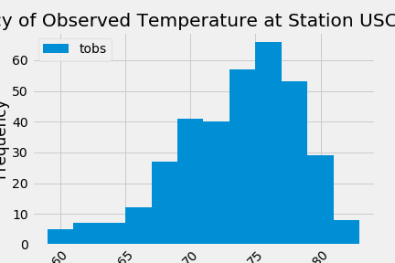

# SQLAlchemy Homework
## Python in Jupyter Notebook, SQLite

### Challenge: Use Python and SQLAlchemy to do basic climate analysis and data exploration of your climate database. All of the following analysis should be completed using SQLAlchemy ORM queries, Pandas, and Matplotlib.

* Choose a start date and end date for your trip. Make sure that your vacation range is approximately 3-15 days total.

* Use SQLAlchemy `create_engine` to connect to your sqlite database.

* Use SQLAlchemy `automap_base()` to reflect your tables into classes and save a reference to those classes called `Station` and `Measurement`.

### Precipitation Analysis

* Design a query to retrieve the last 12 months of precipitation data.
```
last_date = session.query(Measurement.date).order_by(Measurement.date.desc()).first()
```

* Select only the `date` and `prcp` values.
```
precip = session.query(Measurement.date, Measurement.prcp).\
    filter(Measurement.date >= one_year_ago).\
    order_by(Measurement.date).all()
``` 
    
* Load the query results into a Pandas DataFrame and set the index to the date column.
```
precip_df = pd.DataFrame(precip, columns=['date', 'precipitation'])
precip_df.set_index('date', inplace=True)
precip_df = precip_df.dropna()
```

* Sort the DataFrame values by `date`.
```
precip_df = precip_df.sort_values(by='date',ascending=True)
```

* Plot the results using the DataFrame `plot` method.
```
precip_df.plot(title="Precipitation over 12 months")
plt.legend(loc='upper center')
plt.xlabel('Dates')
plt.xticks(rotation = 45)
plt.ylabel('Precipitation')
plt.savefig("Images/Precipitation.png")
plt.show()
```

  

### Station Analysis - climate.py

* Design a query to calculate the total number of stations.
```
locations = session.query(Station)
```

* Design a query to find the most active stations.

  * List the stations and observation counts in descending order.
```
active_stations = session.query(Measurement.station, func.count(Measurement.station)).\
        group_by(Measurement.station).order_by(func.count(Measurement.station).desc()).all()
active_stations_df = pd.DataFrame(active_stations, columns=['Station Name', 'Counts'])
```


  * Which station has the highest number of observations?
```
most_active_station=active_stations[0][0]
```

* Design a query to retrieve the last 12 months of temperature observation data (TOBS).

  * Filter by the station with the highest number of observations.
```
temp = session.query(Measurement.date, Measurement.tobs).\
    filter(Measurement.station == most_active_station).filter(Measurement.date >= one_year_ago).\
    group_by(Measurement.date).all()

temp_df = pd.DataFrame(temp, columns=["date", "temperature"])
temp_df = temp_df.set_index('date')
```

  * Plot the results as a histogram with `bins=12`.
```
plt.hist(temp_df['temperature'], bins=12, label = 'tobs')
plt.title(f"Frequency of Observed Temperature at Station {most_active_station}")
plt.legend(loc='upper left')
plt.xlabel('Observed Temperature (F)')
plt.xticks(rotation = 45)
plt.ylabel('Frequency')
plt.savefig("Images/Temperature.png")
plt.show()
```

   

- - -

